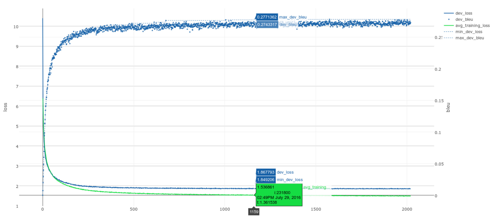

# KyotoNMT
## An implementation of Neural Machine Translation in Chainer.

This code mainly implements the Neural Machine Translation system described in (Bahdanau et al., 2015). Also known as "RNNSearch", or "Sequence-to-Sequence Modeling with Attention Mechanism", this is, as of 2016, the most commonly used approach in the recent field of Neural Machine Translation. This code is being developped at Kyoto University in Kurohashi-Kawahara lab (http://nlp.ist.i.kyoto-u.ac.jp/).

This implementation uses the [Chainer](http://chainer.org/) Deep Learning Library.

NB: The Code here has been used for practical purposes for some months and work well. Documentation is a bit incomplete, but is slowly improving.

This code was used for participation in the translation shared task of the 3rd [Workshop on Asian Translation](http://lotus.kuee.kyoto-u.ac.jp/WAT/). See this [paper](http://www.aclweb.org/anthology/W/W16/W16-4616.pdf) for details.

#Requirements and Installation:

The following is currently required for running Kyoto-NMT:
* Python 2.7.x
* A recent version of `chainer` (> 1.17). 
* The plotting libraries `plotly` and `bokeh` are used in some visualisation scripts

There is now a PyPI repository, so you can install with:

        pip install knmt
        
Dependencies will be automatically installed. However, if `chainer` is not already installed, check the prerequisites for installing `chainer` with `cuda` and `cudnn` support:  http://docs.chainer.org/en/stable/install.html#install-chainer-with-cuda (provided you have a CUDA capable GPU you want to use, of course).

You can confirm that cuda (and optionnally cudnn) are enabled and recognized by chainer by running the `version` subcommand of `knmt`:

        knmt version

In the displayed text, you can look for a section that looks like this:

<pre>
*********** chainer version ***********
version 1.20.0.1
cuda True
cudnn True
cuda_version 7050
cudnn_version 5005
</pre>

Such output shows that CUDA 7.5 was installed and recognized by chainer. The library CUDNN 5 is also installed.

You can of course also install the dependencies separately:
 
        pip install chainer
        pip install plotly
        pip install bokeh
     
To use the latest version of the code in github, you can either first clone the repository, then install it:
        
        git clone https://github.com/fabiencro/knmt.git
        cd knmt
        pip install . -U

or directly install from github:

        pip install git+https://github.com/fabiencro/knmt.git -U

If you plan on modifying the code, it is better to do a "editable" installation:
       
        git clone https://github.com/fabiencro/knmt.git
        cd knmt
        pip install -e . -U
        
This way, modifications to the code in the knmt directory is automatically available without the need to re-install. (see https://pip.pypa.io/en/stable/reference/pip_install/#editable-installs)

#Usage:
## Overview
After installing, a small script called `knmt` should be available in your path.

This script has several subcommands, which can be listed by entering, on the command line:

        knmt --help
Mostly, the most important subcommands are `knmt make_data` (for data preparation), `knmt train` (for training) and `knmt eval` (for translating). Each of these subcommands have several options which can be listed with the `--help` option. eg:
    
        knmt train --help
NB: in previous versions, one could  instead call the three scripts `make_data.py`, `train.py`, `eval.py` in the nmt\_chainer sub-directory, but this is not recomended anymore.

## Data Preparation
The training data should be first preprocessed before training can begin. This is done by the command `knmt make_data`. The important things that this processing will do is:
1. Tokenize the training data
2. Reduce the vocabulary: select the top X most frequent token types and replace others by a special symbol (eg. `UNK`)
3. Assign a unique id number from 0 to X to each remaining token type
4. Convert the training sentences into sequence of id numbers

Step 2 is often necessary due to performance and memory issues when using a large target vocabulary. Step 4 is necessary because the implemented models work on sequence of integers, not sequence of strings.

The required training data is a sentence-aligned parallel corpus that is expected to be in two utf-8 text files: one for source language sentences and the other target language sentences. One sentence per line, words separated by whitespaces. Additionally, some validation data should be provided in a similar form (a source and a target file). This validation data will be used for early-stopping, as well as to visualize the progress of the training. One should also specify the maximum size of vocabulary for source and target sentences. For example:

    knmt make_data train.src train.tgt data_prefix --dev_src valid.src --dev_tgt valid.tgt  --src_voc_size 100000 --tgt_voc_size 30000

As a result of this call, two dictionaries indexing the 100000 and 30000 most common source and target words are created (with a special index for out-of-vocabulary words). The training and validation data are then converted to integer sequences according to these dictionaries and saved in a gzipped JSON file prefixed with `data_prefix`.

## Training
Training is done by invoking the `knmt train` command, passing as argument the data prefix used in the data preparation part.

    knmt train data_prefix train_prefix

This simple call will train a network with size and features similar to those used in the original (Bahdanau et al., 2015) paper (except that LSTMs are used in place of GRUs). But there are many options to specify different aspects of the network: embedding layer size, hidden states size, number of lstm stacks, etc. The training settings can also be specified at this point: weight decay, learning rate, training algorithm, dropout values, minibatch size, etc. 

knmt will create several files prefixed by train_prefix. 
A JSON file train_prefix.config is created, containing all the parameters given to `knmt train` (used for restarting an interrupted training session, or using a model for evaluation). 
A file train_prefix.result.sqlite is also created, containing a sqlite database that will keep track of the training progress. 

Furthermore, model files, containing optimized network parameters will be saved regularly. Every n minibatches (by default n = 200), an evaluation is performed on the validation set. Both perplexity and BLEU scores are computed. The BLEU score is computed by translating the validation set with a greedy search.

The models that have given the best BLEU and best perplexity so far are saved in files `train_prefix.model.best.npz` and `train_prefix.model.best_loss.npz` respectively. This allows to have early stopping based on two different criterions: validation BLEU and validation perplexity.

The sqlite database keep track of many information items during the training: validation BLEU and perplexity, training perplexity, time to process each minibatch, etc. An additional script `graph_training.py` can use this database to generate a plotly (https://github.com/plotly) graph showing the evolution of BLEU, perplexity and training loss. This graph can be generated while training is still in progress and is very useful for monitoring ongoing experiments. 

### Resuming training

During training, `knmt` will save snapshots of the model and trainer states regularly (how often is controled by the `--save_ckpt_every` option. These snapshots are located in the `train_prefix/` sub_directory. In addition, when an exception is encountered (such as an out-of-memory error, or a Ctrl+C user interruption), knmt will attempt to save a `final_snapshot` file.

Training can be resumed from any of these snapshot files by adding the `--load_trainer_snapshot` option to the the original command:
`knmt train data_prefix train_prefix --option1 --option2 xxx --load_trainer_snapshot train_prefix/final_snapshot`

Warning: The way snapshot saving and handling is being modified in the develop branch, so this method for resuming will be slightly changed shortly.

## Evaluation

Evaluation is done by running the command `knmt eval`. It allows, among other things, to translate sentences by doing a beam search with a trained model. The following command will translate `input.txt` into `translations.txt` using the parameters that gave the best validation BLEU during training:

    knmt eval train_prefix.config train_prefix.model.best.npz input.txt translations.txt--mode beam_search --beam_width 30

We usually find that it is better to use the parameters that gave the best validation BLEU rather than the ones that gave the best validation loss. Although it can be even better to do an ensemble translation with the two. The `eval.py` script has many options for tuning the beam search, ensembling several trained models, displaying the attention for each translation, etc.

### UNK replacement
In general, the translation process may generate some tags `T_UNK_X`, where `X` is an integer. The model learned to generate these tags if it was given some training data containing `UNK` tags (see data preparation section). If the model generate a `T_UNK_X` tag, it indicates it thinks that the correct word that should have been generated is outside of its vocabulary, but corresponds to the translation of the source word at position `X`. One can then try to replace these tags with the correct translation using bilingual dictionnnaries (such an idea was originally proposed in (Luang et al., 2015) ).

`knmt utils` is a subcommand of `knmt` that contains sub-subcommands (yes, sub-subcommands are a bit unusual) giving access to some utility scripts. The command `knmt utils replace_tgt_unk` is provided to do this `UNK` tag replacement automatically. It expects a dictionnary in JSON format associating source language words to their translation. After having generated the translation `translation.txt` of input file `input.txt` using the `knmt eval` command, one can generate a file `translation.no_unk.txt` in which `UNK` tags have been replaced with the following command:

      knmt utils replace_tgt_unk translation.txt input.txt translation.no_unk.txt --dic dictionary.json

## Using GPUs

Neural Network training and evaluation can often be much faster on a GPU than on a CPU. Both `knmt eval` and `knmt train` accept a `--gpu` argument to specify a GPU device to use. `--gpu` should be followed by a number indicating the specific device to use. eg. `--gpu 0` to use the first GPU device of the system; `--gpu 2` to use the third GPU device (assuming the machine has at least 3 GPUs).

## Visualisation

### Visualisation of training
The evolution of the training (training loss, validation loss, validation BLEU, ...) is curently stored in a sqlite file `training_prefix.result.sqlite` created during the training process.

At any time during and after the training, one can generate a graph showing the evolution of these values. The utils subcommand `knmt utils graph` will take such a `*.result.sqlite` file and generate an html file containing the graph. This uses the `plotly` graphing library.

        knmt utils graph training_prefix.result.sqlite graph.html
 
This will result in a graph similar to this one, where training loss appears as a green line, validation loss as a blue line, and validation BLEU appears as a scatter plot of small blue circles:

## Recommended Options

        #! shell
        knmt train /path_to_experiment_dir/prefix /path_to_experiment_dir/prefix_train --gpu 0
        --optimizer adam
        --weight_decay 0.000001
        --l2_gradient_clipping 1
        --mb_size 64
        --max_src_tgt_length 90
        // use smaller value if frequently running out of memory

## Papers

Kyoto University Participation to WAT 2016. Fabien Cromieres, Chenhui Chu, Toshiaki Nakazawa and Sadao Kurohashi. 2016. Proceedings of the 3rd
Workshop on Asian Translation.[URL](http://www.aclweb.org/anthology/W/W16/W16-4616.pdf)

Kyoto-NMT: a Neural Machine Translation implementation in Chainer. Fabien Cromieres. 2016. Proceedings of COLING 2016: System Demonstrations.
[URL](https://www.aclweb.org/anthology/C/C16/C16-2064.pdf)